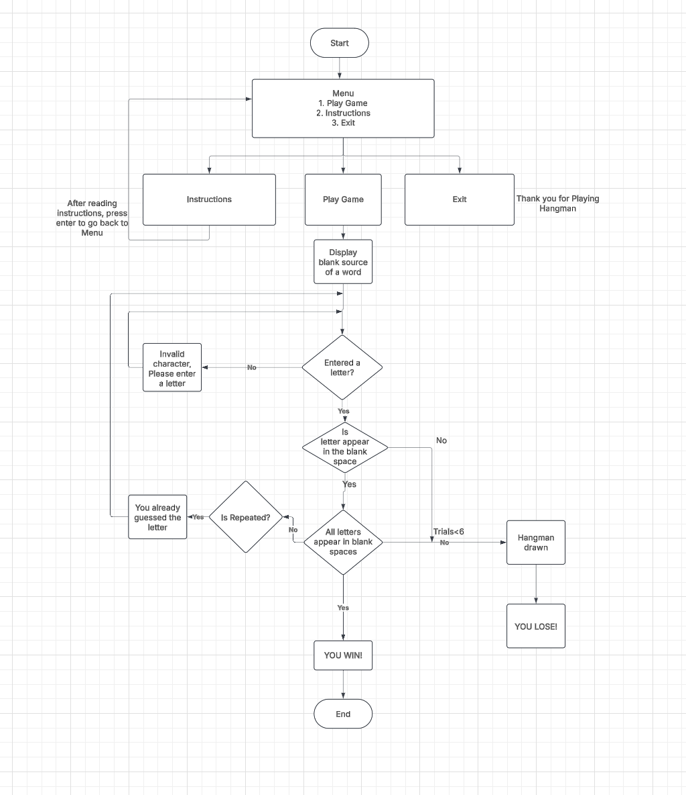
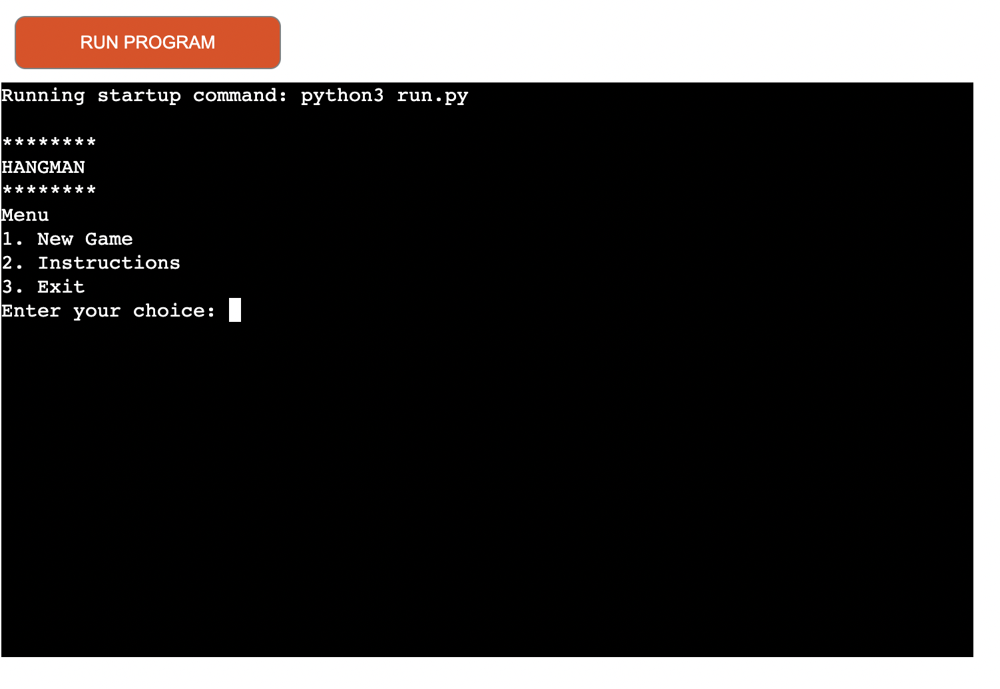
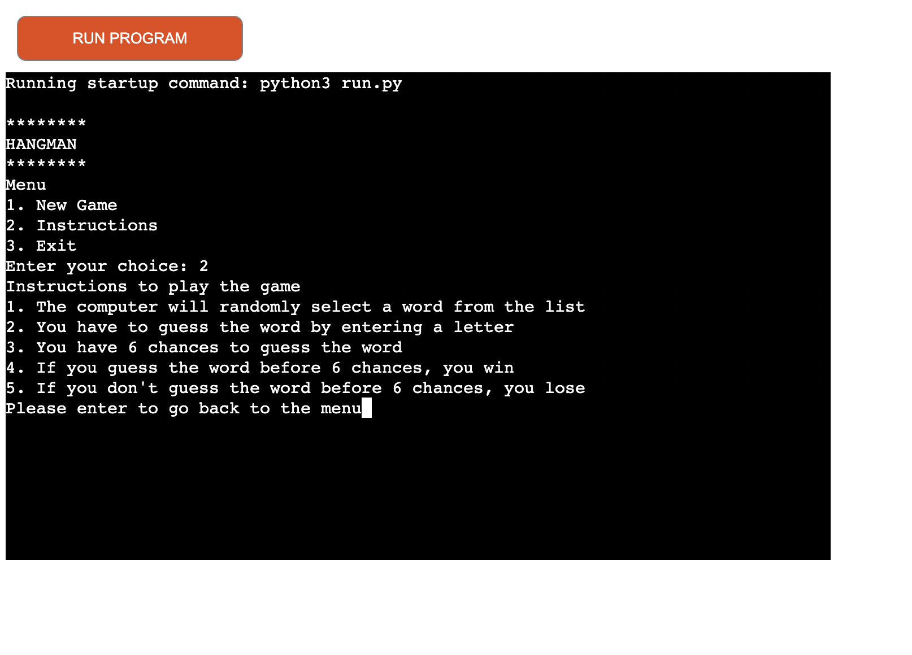
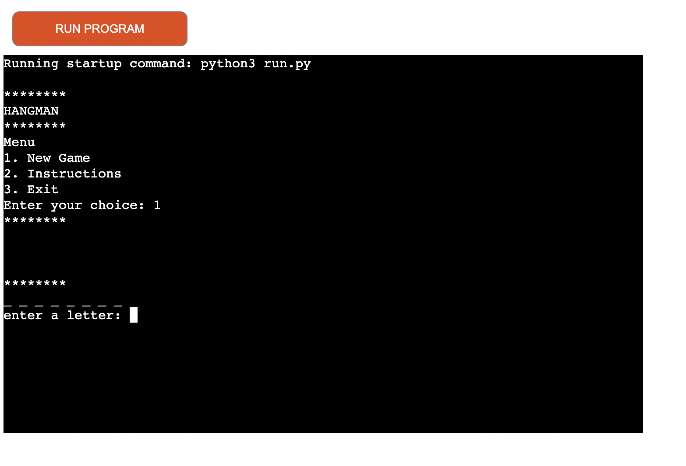
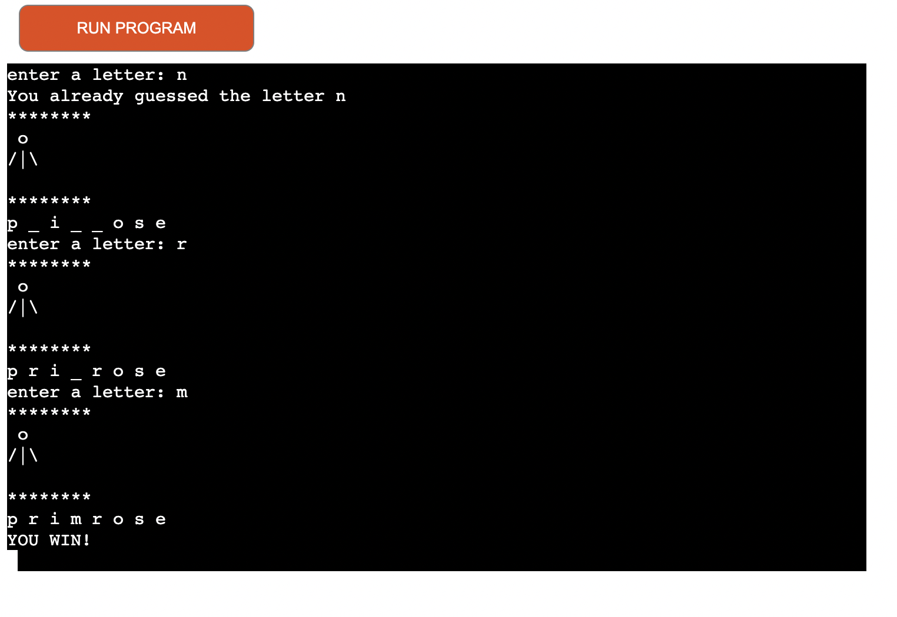
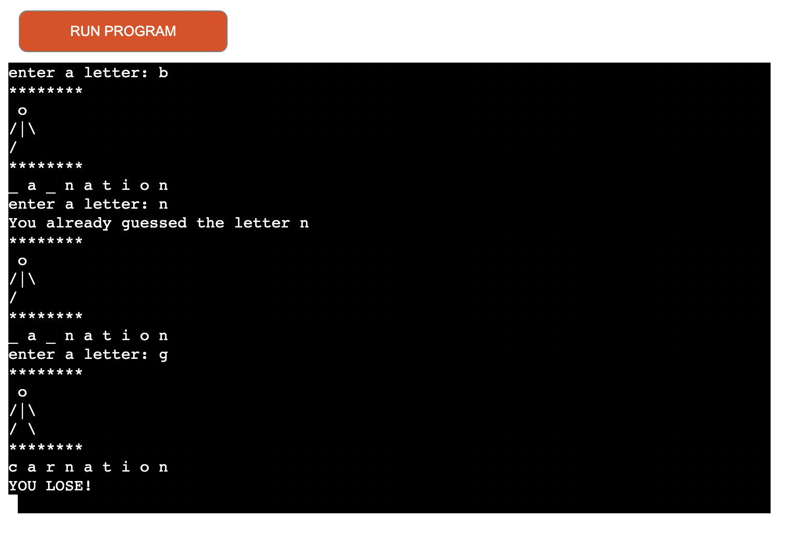
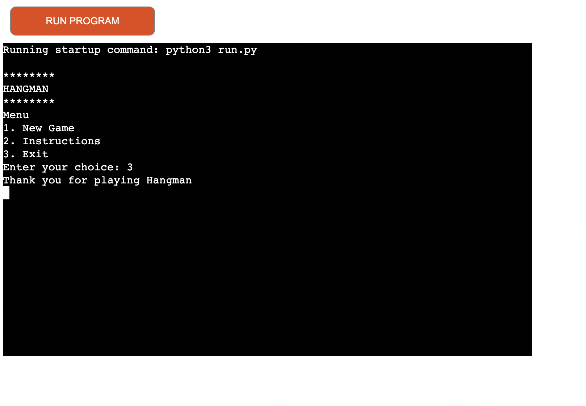

# **The Hangman Game**
## **Overview**

Hangman is a word guessing game. It is considered as one of the classic game where a player will try to figure out the word by guessing letters one by one. This is an online game and it's useful for educational or entertainment purpose.

Basic Rule of the game is that, user will be displayed with the blank spaces (underscores) to guess the word. Based on number of hints user can guess a letter for each one. If the guessed letter is in the word, then it replaces the corresponding underscore with a guessed letter. For each incorrect guess, a body part (head, arms, torso and legs) is added. After 6 incorrect guesses the game ends in a loss for the player/user.

Winning and losing of the game will depend on the user guessing all the letters in the word before the number of wrong guesses are over.

Win: The game is won if the player guesses all the letters in the word before the hangman figure is fully drawn.
Loss: The game is lost if the guesser runs out of all the chances (i.e., if the hangman is fully drawn and the word remains incomplete).

The game is Python-based and uses functions, for loops, while loops and if/elif/else statements to achieve the desired outcome. It features hangman ASCII art.

Click [here](https://hangmangame-python-93af8000a2f1.herokuapp.com/) to see the final deployment of the game

 

## Table of contents:
1. [**Site Overview**](#site-overview)
1. [**Planning stage**](#planning-stage)
    * [***Target Audiences***](#target-audiences)
    * [***User Stories***](#user-stories)
    * [***Site Aims***](#site-aims)
    * [***Lucid Chart***](#lucid-chart)
    * [***Color Scheme***](#color-scheme)
    * [***Typography***](#typography)
1. [**Current Features**](#current-features)
    * [***Menu***](#menu)
    * [***Instructions***](#instructions)
    * [***New Game***](#new-game)
    * [***Exit***](#exit)
1. [**Future-Enhancements**](#future-enhancements)
1. [**Testing Phase**](#testing-phase)
1. [**Deployment**](#deployment)
1. [**Tech**](#tech)
1. [**Credits**](#credits)
    * [**Content**](#content)
    * [**Media**](#media)
    * [**Honourable mentions**](#honorable-mentions)
​
## **Planning Stage**

 

#### **Target Audiences:**
* People who likes word games.
* People who want to improve their vocabulary.
* People who to play hangman game online.
* People who wants to get rid of boredom and entertain themselves.
* Aspiring coders who want to learn python coding, can refer the cited tutorials to learn.

​
#### **User Stories:**
* As a user, I want to start a new game of hangman.
* As a user, I want to learn and understand the instructions.
* As a user, I want to select from Menu (Whether I want to play game, see instructions or exit).
* As a user, I want the game to run smoothly and bug-free.
* As a user, when I win or lose, I should get a clear message about game status.
* As a user, when I provide invalid characters or input, I should be displayed with the proper error messages.

​
#### **Site Aims:**
* To offer user a online, bug free and smooth version of classic hangman game. 
* To provide a user interface which will be clean and simple with no need to reference external sources.
* To provide clear instructions on how to play the game.
* To provide an enjoyable user experience of playing hangman guessing game.

 

#### **Lucid Chart:**

Project planning has been done with the help of Lucid Chart [LucidChart](https://www.lucidchart.com). Lucid chart is widely used for brainstorming, planning, and organizing any project. 
This proved to be very useful tool when it came to visualising the various stages invloved in this game.

This is the flow chart which assisted the development of the game:

 ​

#### **Colour Scheme:**
​

* Not in scope for the current project.

​
#### **Typography**
​
* Not in scope for the current project.

​ 

## **Features**

#### **Menu**

* The game starts with the layout where user can select an option among "New Game", "Instructions" and "Exit". Based on their choice user will be redirected to the desired outcome.

Options Breakdown:
* New Game: Starts a new game of Hangman, resetting the game state and selecting a new random word.
* Instructions: Displays a screen or modal with the rules of the Hangman game, how to play, and how the game works.
* Exit: Closes the game by saying thank you for playing hangman.
​
#### **Instructions** 

* The Instructions section of a Hangman game provides players with the necessary information on how to play, the game’s rules. 
Objective of the game and instructions as follows.
* The goal of Hangman is to guess a hidden word by suggesting letters, one at a time.
* The computer will randomly select a word from the list.
* You have to guess the word by entering a letter.
* You have 6 chances to guess the word.
* If you guess word before 6 chances, you win.
* If you dont guess the word before 6 chances you lose the game.
* Then you are asked to proceed by pressing enter again.

#### **New Game**

* This is the primary space where the game is played. It consists of several key components where the player interacts with the game, makes guesses, and can see the results of their actions. Here I will be explaining  the game's features.

* The game has already consists of the list of words in a separate file called words.py. This file has been imported where the function to play the game is coded. When the user chooses 1 on the interface to play the game, hangman area without any ascii characters are displayed along with the word to be guessed as a series of blank spaces (underscore lines). User is asked to enter a letter or guess a letter based on the analysis by seeing the number of character spaces of the guessing word.

* Upon guessing a wrong letter, hangman ascii art will be displayed to the user. User will have 6 trails to guess the correct word. Initially when no incorerct guesses are made by the user, blank space with no hangman art is displayed. For 1 incorrect guess, head will be displayed. And for 2 incorrect guesses, head and torso will be displayed. This will be continued untill a visual representation of the hangman figure for wrong guess reaches 6. Once the game ends, this area shows whether the player won or lost.

* If the user guesses the word correctly before the number of trails end, he wins the game. If the user cannot guess the word correctly. After the number of trials he will lose the game.

#### **Exit**

* If the user somehow thinks he doesn't want to play the game after he initiated he can always choose to exit by entering 3. 
And user will be displayed with a message saying, "Thank you, now you are exited the game."

 

​
## **Future-Enhancements**
​
There can be many areas where the game can be enhanced. But due to project tight deadline and due to the challenges the scope was limited
Further enhancements can be as follows.
​
* Adding a timer while guessing a letter.
* Introduce different categories. (Currently only flower names/words are guessed.)
* Option to randlomly quitting the game in between.
* An hint system to get a user about the word
* After exiting the game user should be presented again with Menu option if he/she wants to check the instructions and then play again.
​
## **Testing Phase**
​
**Functionality**

* Implementation 🏭: Check whether user is able to play game from start to finish
* Test 🧪: Played the game locally many times.
* Result 🏆: The game worked as expected
* Verdict ✅: PASS

 

* Implementation 🏭: Check whether tests are passed for valid character.
* Test 🧪: Test the game with all the possible valid characters.
* Result 🏆: Game worked as per expected result.
* Verdict ✅: PASS.

 

* Implementation 🏭: Check whether game worked as expected for invalid characters.
* Test 🧪: I played the game on a local terminal with invalid character. Validation was not present initially
* Result 🏆: Tests didnt work as expected results at first, after fixing the bug this test has been made pass.
* Verdict ✅: Initially test was failed and then after bug fix the test is PASS

 

* Implementation 🏭: Check whether user is able to select diffrent menu options and corresponding menu list is displayed
* Test 🧪: Tried selecting different menu options.
* Result 🏆: Game responded as expected.
* Verdict ✅: PASS

 
​

**Validators**

* The PEP8 Online Validator was down when creating this project, however I added a PEP8 validator to my workspace by running the command: "pip3 install pycodestyle". The results can be found [here](assets/images/pep8validator.png)

* The validator flags a number of warnings and one error. Error was related to the equality operator is used in place of assignment operator. Other a quite number of minor warnings were present. All were related to the extra spaces and blank lines between the functions. In my final mentor session, I was informed about removing these extra spaces.

​
## **Bugs**
​
Some of the bugs were identified during testing. They are listed below.

* 🐞 - Initially the ascii charcater for hangmans head was towards left and were not in align with hands and legs. 
* ⚒️ - Didnt checkj properly the alingmments of the ascii characters which makes the hangman.
* ✅ - Added a space towards left of the ascii character which makes the head.

 

* 🐞 - When the duplicate characters are entered, there was no validation.
* ⚒️ - Since validating duplicate entries of the character was missing.
* ✅ - Added a new method to validate the duplicate entries.

​ 

* 🐞 - User could enter special characters, digits or anything 
* ⚒️ - The implementation for invalid characters was not in the place.
* ✅ - Implemented the valid character checking, if invalid character is enetred, an error is thrown to the user.

 

* 🐞 - Menu list was wrongly ordered.
* ⚒️ - Initially menu items were wrongly ordered with incorrect numbering.
* ✅ - Order of the Menu list was corrected along with the numbering.

 

* 🐞 - After exiting the game by choosing option 3, user have to refresh/reload the game
* ⚒️ - After exiting the game, user is not provided an option to replay the game by displaying Menu again. (Refersh or reload is required)
* ✅ - This feature is added as an enhacement to the current game.

 

## **Unfixed Bugs**

* All the bugs which have been identified have been fixed and there are no known defects.

## **Deployment**

## ***Final Deployment to Heroku:***  
  
The project was deployed to [Heroku](https://www.heroku.com) using the below procedure:-    
  
1. **Log in to Heroku** or create an account if required.
1. **click** the button labeled **New** from the dashboard in the top right corner, just below the header.
1. From the drop-down menu **select "Create new app"**.
1. **Enter a unique app name**. I chose battleships-1977 for this project, for reasons stated above.
1. Once the web portal shows the green tick to confirm the name is original **select the relevant region.** In my case, I chose Europe as I am in the UK.
1.  When happy with your choice of name and that the correct region is selected, **click** on the **"Create app" button**.
1. This will bring you to the project "Deploy" tab. From here, navigate to the **settings tab** and scroll down to the **"Config Vars" section**. 
1. **Click** the button labelled **"Reveal Config Vars"** and **enter** the **"key" as port**, the **"value" as 8000** and **click** the **"add"** button.
1. Scroll down to the **buildpacks section of the settings page** and click the button labeled **" add buildpack," select "Python," and click "Save Changes"**.
1. **Repeat step 11 but** this time **add "node.js" instead of python**. 
   * ***IMPORTANT*** The buildpacks must be in the correct order. If node.js is listed first under this section, you can click on python and drag it upwards to change it to the first buildpack in the list.
1. Scroll back to the top of the settings page, and **navigate to the "Deploy" tab.**
1. From the deploy tab **select Github as the deployment method**.
1. **Confirm** you want to **connect to GitHub**.
1. **Search** for the **repository name** and **click** the **connect** button next to the intended repository.
1. From the bottom of the deploy page **select your preferred deployment type** by follow one of the below steps:  
   * Clicking either "Enable Automatic Deploys" for automatic deployment when you push updates to Github.  
   * Select the correct branch for deployment from the drop-down menu and click the "Deploy Branch" button for manual deployment. 

The final deployment can be viewed [here](https://hangmangame-python-93af8000a2f1.herokuapp.com/)
​
## **Tech**
​
Have used the following technologies to build the Hangman project:
​
- Python

## **Libraries**

The following library was used:

* Random - Used to generate random choice of words to be selected to play the game.

## **Software**

The following software are used:

- VS Code : To create code and pushing it to the github
- Git (Gitpod and Github) : Used for version controlling.
- Heroku is used for deploying the project.
- Lucid Chart is used to create the flow chart of the project.

### **Media:**

* Not in scope for the current project.
​
 

## **Credits**

* A youtube tutorial which helped me to understand and build logic for hangman game was really great.
[Bro Code](https://www.youtube.com/watch?v=ag8NtD1e0Kc). Based on this tutorial, I have used the logic to build the game. Then later it is enhanced with mentors guidance and suggestions.

* Another youtube tutorial related to hangman game was very helpful initially to understand on how to play the game. The course is by [Triple S Games](https://www.youtube.com/watch?v=cGOeiQfjYPk) 

* Course material in Scrimba was also very helpful for me to understand python in a short time. [Scrimba-Python](https://scrimba.com/learn-python-c03/~00)

* I have also used Chat-GPT to understand the Hangman game and its features. [Chat-GPT](https://chatgpt.com/)

### **Honourable mentions**
* Many thanks to my mentor, Richard Wells, who is always guiding me and helping me with the project. He is very dedicated and kind person who   gave me valuable feedback and ideas to enhance the project. 
* Many thanks to code institute student support, they always helped with python errors and tutored me whenever required.
* Many thanks to code institute community in slack. 
* Many thanks to family and friends who are always an inspiration to me.
